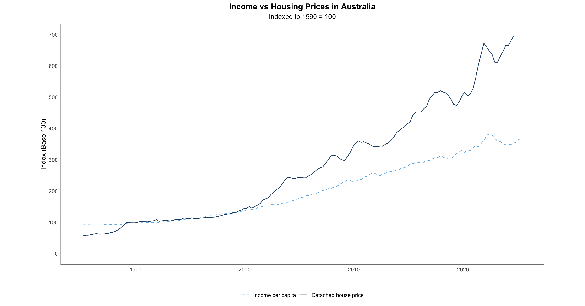
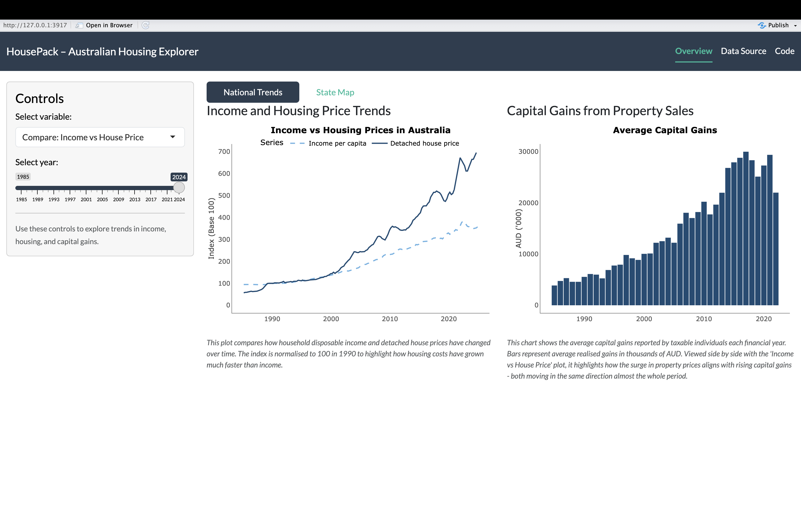

# housepack
<!-- badges: start --> <!-- badges: end -->

The goal of **housepack** is to help users explore the connection between Australian housing prices, disposable income per capita, and capital gains from 1985 to 2024.
The package provides cleaned datasets and simple tools to visualise trends that describe how the housing market has evolved across time and regions.

A detailed tutorial and example analysis are available at [housepack website](https://etc5523-2025.github.io/assignment-4-packages-and-shiny-apps-klee0195/). This site includes a guide explaining functions in `housepack` and the Shiny app’s interactive features. I also provide a sample vignette demonstrating how to explore income, housing, and capital gains trends using `housepack`.

## Installation

You can install the development version of **housepack** from GitHub:

``` r
# install.packages("remotes")
remotes::install_github("ETC5523-2025/assignment-4-packages-and-shiny-apps-klee0195")
```

After installation, load the package:

``` r
library(housepack)
```

## Data included

The package includes three processed datasets:

- `income_pc`: yearly and quarterly estimates of disposable income per capita in Australia.

- `detached_full`: detached house price index for eight states and territories from 1985 to 2024.

- `cgt_full`: simulated average capital gains for taxable individuals based on ATO statistics.

These datasets support both the static functions and the interactive Shiny app.

## Functions

The package provides helper functions that make visualisation and comparison easier.

`to_index()`

Converts a numeric time series into an index with a chosen base year.

This function is useful when comparing growth across different variables that use different scales.

``` r
indexed_income <- to_index(income_pc$Income_per_capita,
                           year = income_pc$Year,
                           base_year = 1990)
```

`compare_trends()`

Creates a plot that compares indexed income per capita with detached house prices over time.
This helps reveal how income and housing costs have diverged since the 1990s.

``` r
compare_trends(income_pc, detached_full, base_year = 1990)
```



## Shiny app

After installation and loading the package, open the interactive dashboard:

``` r
run_housepack()
```

The app shows national and state housing trends.
Users can compare income growth and house prices or view differences across states through an interactive map.


