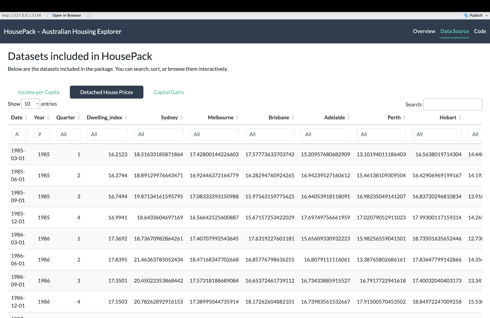

```{r, include = FALSE}
library(housepack)
library(ggplot2)
```

## Overview

`housepack` provides cleaned datasets and visual tools to explore how Australia's housing market, disposable income, and capital gains have evolved from **1985 to 2024**. It includes both static plotting functions and an interactive Shiny dashboard.

## Datasets included

| Dataset | Description |
|----------|-------------|
| `income_pc` | Real household disposable income per capita (quarterly) |
| `detached_full` | Detached house price index for all states and Australia overall |
| `cgt_full` | Average capital gains for taxable individuals (1985–2023) |

## Comparing income and housing prices

Before comparing income and housing trends, it’s useful to express them on a **common index scale**.

### Converting to index values

The `to_index()` function converts any numeric time series into an index relative to a chosen base year (default = 1990).  
This is helpful when comparing growth rates across variables that have different units, such as income (AUD) and house prices (index points).

```{r}
indexed_income <- to_index(income_pc$Income_per_capita,
                           year = income_pc$Year,
                           base_year = 1990)
head(indexed_income)
```

Each value is rescaled so that the base year equals 100, allowing percentage-style comparisons across time.

### Comparing trends directly

Building on this idea, the `compare_trends()` function automatically applies `to_index()` to both datasets - income and detached house prices - and plots them side by side.

```{r, warning = FALSE}
compare_trends(income_pc, detached_full)
```

By normalising both series to the same base year, `compare_trends()` shows how **detached house prices have grown much faster than household income** since the 2000s.

## Launching the interactive Shiny app

`housepack` also includes a built-in **interactive Shiny dashboard** that lets users explore income, housing, and capital gains data in detail.

### 1. How to launch

To start the dashboard, simply run:

```{r, eval = FALSE}
run_housepack()
```

### 2. App structure

The dashboard is organized into **four main tabs**:

| Tab | Description |
|----------|-------------|
| **National Trends** | Compare national trends in income, detached house prices, and capital gains over time using interactive line and bar charts |
| **State Map** | Explore regional differences in detached house prices via a choropleth map and trend lines for each state |
| **Data Source** | View the underlying datasets interactively with filtering and search options. Useful for checking raw data values and provenance |
| **Code** | Displays the core Shiny server logic for reproducibility and learning purposes |

Built with `bslib::bs_theme(bootswatch = "flatly")`, `plotly`, `ggplot2`, and `DT`, the app provides a consistent, clean design and seamless interactivity.

### 3. How to use

When the app opens:

1. Navigate to the **Overview** tab to see how income and housing prices have evolved since 1985.

- Use the dropdown to select “Income per Capita”, “Detached house price (Australia)”, or “Compare: Income vs House Price”.

- Move the **year slider** to focus on specific time periods.

- Hover on plots to view values interactively.

```{r, echo=FALSE, out.width="100%", fig.align="center"}
knitr::include_graphics("imgs/rm2.png")
```

2. Switch to the **State Map** tab to examine regional differences.

- Adjust the year slider to see the detached house price index by state.

- Select “All” or a specific state to compare trends.

```{r, echo=FALSE, out.width="100%", fig.align="center"}
knitr::include_graphics("imgs/rm3.png")
```

3. In the **Data Source** tab, explore the three datasets (`income_pc`, `detached_full`, and `cgt_full`) using searchable, sortable tables.

The app allows you to:

- Compare national income, housing, and capital gains

- View state-level differences via a choropleth map

- Analyse long-term trends across regions

```{r, echo=FALSE, out.width="100%", fig.align="center"}

```

## Exploring insights with `housepack`

The `housepack` toolkit - together with its Shiny dashboard - offers several ways to explore Australia's housing and income dynamics.

Here are some ideas you can investigate:

- **Track how income and housing diverged over time:**  
  Use `compare_trends()` or the “Overview” tab to see how detached house prices have grown much faster than household income since the 2000s.

- **Spot regional affordability gaps:**  
  The “State Map” tab reveals which states experienced the steepest price growth. Try adjusting the year slider to compare Sydney’s surge with steadier markets like Adelaide or Hobart.

- **Explore capital gains patterns:**  
  Check how realised property gains evolved alongside housing prices - a hint of how investment activity followed the housing boom.

- **Examine data sources directly:**  
  Browse the “Data Source” tab to view the underlying datasets (`income_pc`, `detached_full`, `cgt_full`) and trace where each trend originates.

**Example interpretation:** By 2024, **New South Wales** reached a detached-house index near 250, while most other states remained around 170–190 - a clear sign that affordability pressures have been most acute around Sydney. These interactive tools make it easy to connect such long-term trends with broader questions about housing policy, income growth, and regional inequality.

## Summary

`housepack` connects household income, housing prices, and capital gains in one cohesive toolkit for exploratory analysis of Australia's housing market.

